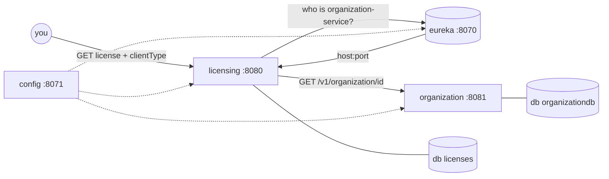

<p align="center">
  
</p>

<p align="center">
  
</p>

<p align="center">
  
  
  
  
</p>

---

## What is this place?

A lab from the **Ostock / Spring Cloud** trail: licenses live in one building, organizations in another. They do **not** share a database. They share a rumor mill called **Eureka**.

| Citizen | Port | Job |
|---|---|---|
| `licensing-service` | `8080` | sells keys, then asks “who is this org?” |
| `organization` | `8081` | keeps names, emails, phones |
| `config-server` | `8071` | whispers properties |
| `eureka-server` | `8070` | the phonebook |
| `postgres` | `5432` | two catalogs: `licenses` + `organizationdb` |

`license.organization_id` is just a string that *happens* to match `organizations.organization_id`. Postgres never joins them. The join happens over HTTP after Eureka points at a living instance.



<details>
<summary>📼 Open the terminal tape</summary>

```text
 $  docker compose up -d --build
 >  postgres        ... UP
 >  config-server   ... 8071
 >  eureka-server   ... 8070
 >  organization    ... 8081
 >  licensing       ... 8080
 $  curl localhost:8070          # dashboard
 $  curl localhost:8081/v1/organization/optima
```

</details>

---

## Wake the city

Docker Compose **builds the JARs inside the images**. You do not need to run Gradle/Maven first.

From the repo root (PowerShell, cmd, or bash — same command):

```bash
docker compose up -d --build
```

The first run downloads JDK/Maven/Gradle caches and compiles four services; later runs reuse the images. Docker Desktop must be running.

Do **not** also hit Run in the IDE on the same ports. One process per socket.

If Compose ever tries to pull `ostock/microservice` or fails with `*.jar: not found`, you are on an old checkout — this repo no longer copies host JARs and no longer references that Hub image.

| Check | URL |
|---|---|
| Eureka UI | http://localhost:8070 |
| Registry XML/JSON | http://localhost:8070/eureka/apps |
| Config | http://localhost:8071/licensing-service/dev |
| License API | http://localhost:8080/v1/organization/{orgId}/license |
| Org API | http://localhost:8081/v1/organization/{orgId} |

### On a machine that is not yours

Docker is the only prerequisite — no JDK, no Gradle, no Maven, no Postgres on the host.

```bash
git clone https://github.com/evander006/license-microservice-app.git
cd license-microservice-app
docker compose up -d --build
```

Works the same on Windows, macOS (Intel and Apple Silicon), and Linux. Everyday commands:

```bash
docker compose ps                      # who is up, who is healthy
docker compose logs -f licensing-service
docker compose up -d --build           # rebuild after pulling new commits
docker compose down                    # stop, keep the database volume
docker compose down -v                 # stop and wipe the database
```

Ports `5432`, `8070`, `8071`, `8080`, `8081` must be free on the host.

---

## A tiny ritual (data is not magic)

1. Create an **organization** (PUT keeps the id you choose):

```http
PUT http://localhost:8081/v1/organization/optima
Content-Type: application/json

{"name":"Optima","contactName":"Ivan","contactEmail":"ivan@optima.test","contactPhone":"+7-000"}
```

2. Create a **license** (id becomes a UUID):

```http
POST http://localhost:8080/v1/organization/optima/license
Content-Type: application/json

{"description":"Software product","organizationId":"optima","productName":"Ostock","licenseType":"full"}
```

3. Ask licensing to fetch the org through discovery (when clients are wired):

```http
GET http://localhost:8080/v1/organization/optima/license/{uuid}/discovery
GET http://localhost:8080/v1/organization/optima/license/{uuid}/rest
GET http://localhost:8080/v1/organization/optima/license/{uuid}/feign
```

Three doors, one hallway: **DiscoveryClient**, **@LoadBalanced RestTemplate**, **OpenFeign**.

---

## Layout

```text
microservice/                 licensing-service (Gradle)
  config-server/              native Spring Cloud Config
  organization/               organization-service
  eureka-server/              Netflix Eureka (Maven wrapper)
  docker-compose.yml          the city wall
  docs/ostock-orbit.svg       this README's heartbeat
```

Gradle owns the root. `organization` used to be a Maven guest; the living build is `organization/build.gradle`. Eureka still packs with `mvnw`.

---

<p align="center">
  <sub>built for learning how services find each other · if a container has a pirate name, it is probably a ghost — delete it</sub>
</p>
